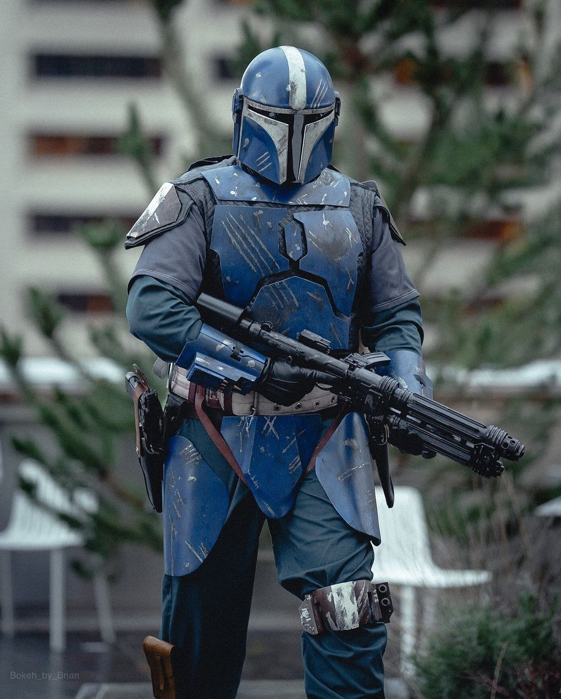
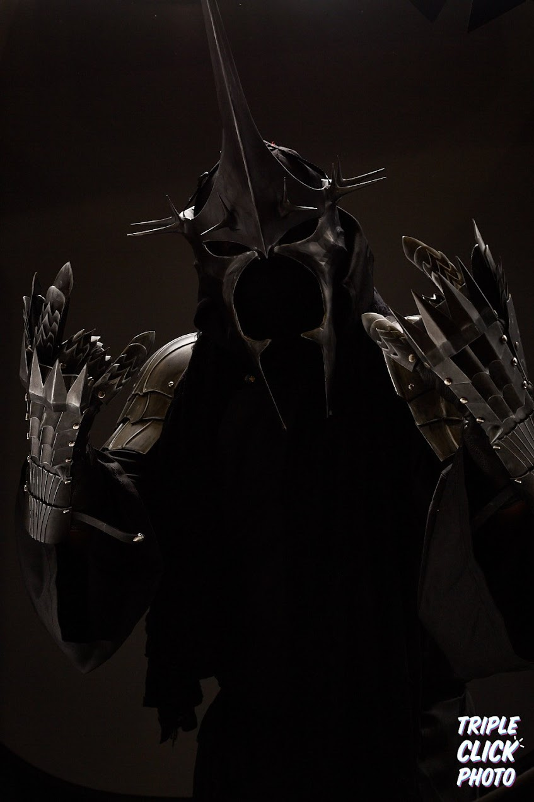

### Intro
Hi I'm Zack, I build cool shit!

 

By day I am a self-taught engineer who has an extremely deep background in various computer systems and programming langauges. Tech has always been my passion in life, and I've been lucky enough to be able to turn that into a career after dropping out of college three times.

When I'm not at work, I'm a maker who is passionate about combining the highly technical with the highly creative. From jury rigging servers together to figuring out what adhesive to use between two different types of plastic, I love to challenge myself, and want to keep growing as a creator.

My hope is that if you're reading this page, you're passionate about these things too. One of the most powerful tools we have at our disposal is our ability to learn from and teach one another, regardless of your skill level. I hope something you find here may be useful to one of your projects (tech or otherwise) - and if so, I'd love to hear about it!

### About this site
`zack.zip` serves as my public journal and blog of adventures in nerditude, and is brought to you by a server rack humming away in my garage - that's about as farm to table as it gets, baby!

### Other hobbies
Want to know what am I up to in the off-season? What my deal is?
Well here are a few things I like doing when I'm not crouched over a sander:

- I'm an avid gamer, and am pushing 19 years on my Steam profile! I'm routinely at [LANFEST](https://lanfest.com/) events, so if LANs are your thing, check 'em out!
- I am also really passionate about the outdoors and nature. Washington State is in my opinion one of the most beautiful places in the world, and I try to take advantage of that fact whenever possible by...
    - Fishing! Primarily saltwater, but have been teaching myself fly fishing over the past year!
    - Hiking! There's nothing that really clears your mind like being on a secluded ridgeline or deep in the mountains enjoying a drink on an alpine lake.
    - Hunting & Shooting! I'm a gold-medalist in the walking contradiction competition, but lefty gun nuts exist. I enjoy the difficulty and precision of the hobby, and use this knowledge to further my propmaking! It also brings me out to beautiful seculuded areas. I try to squeeze in a 3-gun or steel match every now and again, and typically hunt Western WA for deer and waterfowl.
    - And lastly good ole' fashioned offroading.  Getting to the above hobbies sometimes requires going where there just flat out aren't roads (or there haven't been roads in several decades), so I like to get down and dirty with it.

### Give me a shout
I'm some variation of `@horvaticus` most places, so if you see me, feel free to reach out!

***

### Frequently Asked FAQs
Some folks slide into my DMs with the following Q's...

#### Do you do commissions?
Kinda? I am still exploring how to best offer 3D printing and scanning services at this time.

#### How do you handle intellectual property and licensing with comissions?
I strictly follow the original license of any intellectual property I use in my costumes. In some cases, the designs are original, open sourced, or I have purchased a commercial license. In others, I am often using a community personal use license. I do not directly profit off of my props, I do it for fun, for me.

I believe in making the best possible effort to give the original author a shout out too! It's good digital karma and keeps the creative process spinning.

#### Do you prefer Printables or MakerWorld? Why do you post to both?
Because I think it's lame when games get published to one storefront over the other, and feel the same about STL files. Creators get rewarded for total downloads and boosts for published models, but, it's more important to me that you have a choice in where you download your files from. I think the bonuses you get from MakerWorld are better (especially since I run mostly Bambu Printers these days), but I appreciate every download, like, and subscribe no matter which storefront its through!