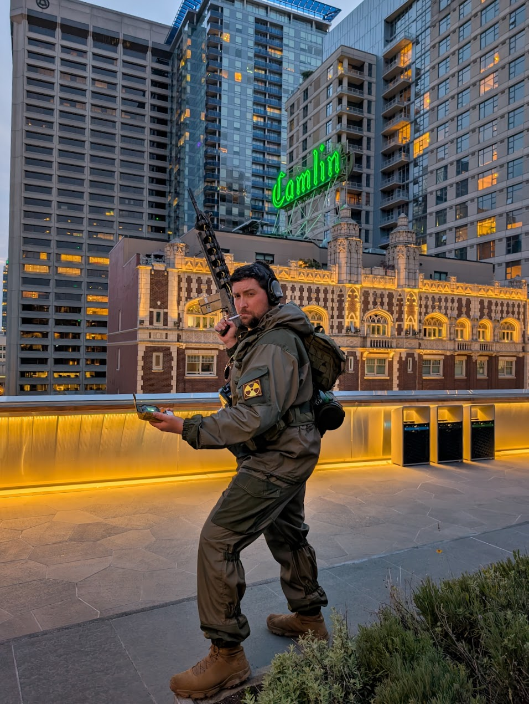

I had a blast making this costume; it wasn't the most technical project I've ever done, but it was really fulfilling on a personal level and got to bring one of my characters to life.

### What is "STALKER"?

> The name "S.T.A.L.K.E.R." is a backronym for Scavengers, Trespassers, Adventurers, Loners, Killers, Explorers and Robbers.
Apart from a really bad hashtag, [STALKER](https://en.wikipedia.org/wiki/S.T.A.L.K.E.R.) is a first-person shooter survival horror RPG that was first released in 2007 for PC.

Basically, it's a game about being a post-apocalyptic treasure hunter in a radioative post-soviet wonderland. I ended up getting the game for my birthday circa 2007, and must have dumped a thousand hours into the STALKER trilogy through the following decade.

Fast forward to today, and I'm about to get my fix back on - STALKER 2 is almost here! After playing the demo at PAX West, I think it's safe to say that the wait will be worth it.

### Entering the Zone
 