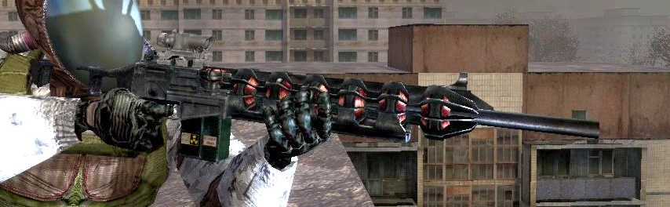
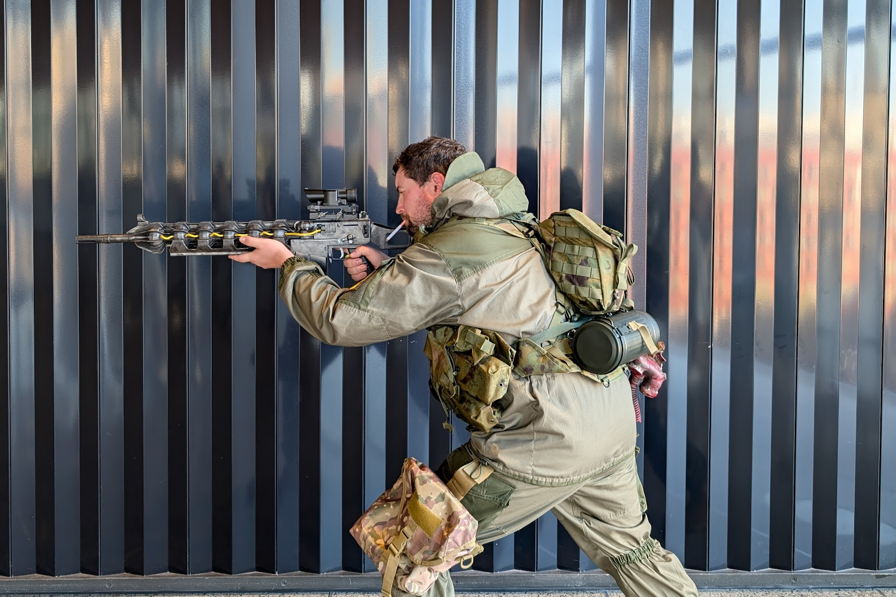
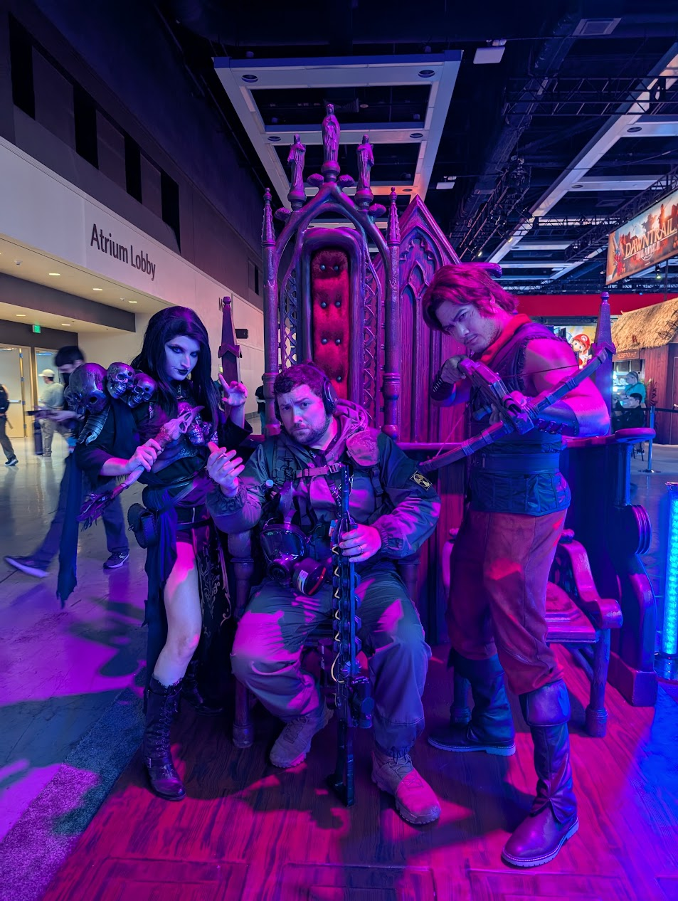

## Intro
I had a blast making this costume; it wasn't the most technical project, but it was really fulfilling on a personal level bringing one of my characters to life. I plan on doing individual logs about the kit props and their creation process, so stick around if you're interested in that.

### What is "STALKER"?

> The name "S.T.A.L.K.E.R." is a backronym for Scavengers, Trespassers, Adventurers, Loners, Killers, Explorers and Robbers.

Apart from a really bad hashtag to try and use, [STALKER](https://en.wikipedia.org/wiki/S.T.A.L.K.E.R.) is a first-person shooter survival horror RPG that was first released in 2007 for PC.

Basically, it's a game about being a post-apocalyptic treasure hunter in a radioactive post-soviet wonderland. I ended up getting the game for my birthday circa 2007, and must have dumped a thousand hours into the STALKER trilogy through the following decade.

Fast forward to today, and I'm about to get my fix back on - STALKER 2 is almost here! After playing the demo at PAX West, I think it's safe to say that the wait will be worth it.

I also got to shoot with the GSC crew at the STALKER 2 booth! I had a really hard time not completely fanboying it up!

***
## Concept & Design
Coming right off another big project, I decided that my time would be better spent focusing on prop making versus fabric projects. This meant that the "Sunrise Suit" that's common with other STALKER cosplayers was off the table for me.

I opted instead to base my build off of a Gorka (Горка) K2 combat suit, which I had recently acquired for... unrelated purposes. This offered a good base to accessorize on top of. The nice part about STALKER cosplays is that there's no specific character you have to kit up as, so, I let my gut guide me on that. I wanted to build a STALKER that would embody how I imagined my character, myself, in the Zone.

There are several factions in the Zone, and I rotated between repping the Loners, Freedom, and the Monolith (glory to the rock). I ended up running into some other Loners and some Mercenaries at PAX.

***
### Battle Rigging
In an attempt to stick with the Soviet-surplus '90s vibe of the gear, I actually attempted to get a SMERSH (СМЕРЧ) rig to build the rest of my costume off of. 

Unfortunately, the American company I ordered through wasn't able to deliver on time, so I ended up going with an airsoft knock-off model in kind of a weirdo dingy camo pattern called "Ruin".

 

This actually ended up working out because the knock-off model incorrectly has the stuff-sack on the upper back instead of the lower back - but this oversight allowed me to hook up a WWI German gas mask canister. The original plan for this was to be an "anomaly" container with lights and a plexiglass window, but, I ran out of time. Perhaps a future improvement?

The other mod I ended up needing to do was ripping out the girth straps around the natural waist and lower hips. I'm, uh, less malnourished than whoever this was made for. I replaced the webbing with stuff 1" and 1.5" nylon from a US manufacturer, and replaced the plastic buckles with metal cobra buckles. A fate that will probably happen to the real SMERSH when it shows up.

I also think the camo ended up working out pretty well, and did a good job being distinct from my two-tone green suit.

***
### Full Kit

Apart from the fabrics, there was exactly one objective I had when designing this costume - I wanted to make a Gauss Rifle. They say the real Gauss Rifle was the friends you made along the way, and I have to say for secondary objectives I am really happy with how the rest of the kit came out.

***
### Gauss Rifle (Item 62)
  

  

Ok - first and foremost this is what I am most proud of for this entire cosplay. I made a 1:1 replica of the Gauss Rifle from the STALKER series, using the original game files. I jury-rigged a Blender plugin for the X-Ray engine to export the game files in a mesh format that I was able to import into Fusion 360.

Once inside Fusion 360, I attempted to convert the model into a solid; which yielded a spotty mess of surfaces that all had to be painstakingly stitched together to create solids. Once I had the whole gun file solidified, I then proceeded to make some adjustments to the prop geometry. These changes included:
* completely solidifying the whole gun, including normalization of each individual fin segment so they all match
* adjustment of the stock to be closer to an IRL G36 stock (so you can actually shoulder it)
* completely remodeling the front sight
* decoupling the SUSAT scope from the base model
* rebuilding the handguard so it now attaches to the receiver
* modeling dowel holes through the entirety of the print
* opened the wiring holes so I could use 4.5mm OD wire as a practical effect
* created magnet mounts for the magazines to attach to the receiver
* logically cut up the print for best printing performance
* lastly, removed the trigger from the trigger group... because those always get broken and it's important to be able to glue them back on!

After all that was done, I decided to just purchase a SUSAT scope clone, since it'd get kind of complicated printing that out and I was getting short on time. Though I kind of threw money at the problem, I was actually able to cobble together a Picatinny/Weaver rail mod to permanently attach to the top of the Gauss Gun. The end result is that I can actually remove the SUSAT scope as a party trick!

 

After milling out the holes in the aluminum rail, I secured it to the print with 3" long drywall screws via pre-drilled holes that were soaked in epoxy. 

All in all it held up very well all weekend, except for the trigger breaking. Nothing superglue can't fix. If I could change one thing, I would use a different adhesive other than superglue for attaching the wires, since CA glue appears to not adhere to silicone wires very well. Had to keep re-attaching those.

Want to make your own? The files are available at:
- [MakerWorld](https://makerworld.com/en/models/625776#profileId-550226)
- [Printables](https://www.printables.com/model/998013-stalker-gauss-rifle)

***
### Echo Detector

 

This thing was an absolute blast to work on. In the video game this little device helps the player detect anomalies in their search of artifacts. How this prop works though is there is an Arduino inside which runs a program that produces a flash and a beep based on local Bluetooth Low Energy signals.

The end result was an interactive prop that I was able to comb the convention floor with! It was a real head turner and conversation starter!

For the decals, I was able to use Google Gemini to take the screenshot from the game and export to text (and translation into Ukrainian), which I then used in combination with GIMP and Inkscape to create my own custom decals. Those were then printed on waterslide sheets.

Huge shout out to [DoctorZer0](https://www.printables.com/model/823279-stalker-echo-detector-printable-model) for creating such an awesome model, providing the inspiration for the Arduino code, and the internals so I could reverse engineer and build my own.

In a later post I will be releasing the code fork, along with a parameter that will allow users to adjust the sensitivity, as there's a lot of interference in a convention. I also needed to modify the mesh of the detector to fit my switches and LEDs - those will go to a remix on Printables.
***
### Compass Artifact
 

The Compass is a rare artifact that is able to locate gaps in anomaly fields.

This was printed in several pieces - two domes that screwed together, an internal carriage system for holding the electronics, and then a bunch of crystalline pieces that thread into the domes (which I printed on my resin printer for a clear effect). I used [Bambu Lab PLA Galaxy](https://us.store.bambulab.com/collections/bambu-lab-3d-printer-filament/products/pla-galaxy?variant=41834260103304) for the outer shell, and opted to not post-process it since my printer was absolutely dialed in for that print.

The Compass was a real head turner, however one of the crystals broke off during handling. I actually printed off spare crystals before the convention, but, I think more than two props is too many, and I found myself juggling on Day 1, so I ended up rotating between it and the Echo Detector.

Thanks to [@JakubKoci](https://www.printables.com/model/29537-compass-artifact) for the awesome model!

***
### Misc. Items
Sometimes you get spare time in between projects drying or printing, so these are some extras I cranked out!

#### Cossacks Vodka

Though a bit tricky, these "Cossacks Vodka" bottles were a big hit with fans of the game. I wanted to test drive the waterslide decals before putting them on anything I couldn't scrub. Luckily I only needed one test drive and the "bad" one looked pretty good!

At the end of the evening I ended up using them as water bottles... which of course got a few funny looks. Yep, definitely filled with water.

#### Snork Trophy

The Snork is a classic enemy in the Stalker series. I created a quick trophy by beating the absolute shit out of a Soviet PDF-D gas mask, and then slathering it in red, brown, and black paint.

What I didn't realize is that the lenses are real glass, so, after getting glass everywhere I ended up using liquid UV resin to coat the glass so my dumbass doesn't cut myself on it.

#### Off the Shelf Gear

There was some off the shelf gear I tossed into this build as well:
* [The surprisingly popular fake cigarette](https://amzn.to/3z88O1o)
* Oakley Combat Boots
* Mestel SGE 400/3 Gas Mask (if you guys go the real gas mask route, get one with a diaphragm if you're going to wear it)
* Mira Drop-Leg Gas Mask Pouch
* Sordin Pro-X Neckband EarPro

***
## Ready for the Zone!
  

All in, the total build time was around 130 hours, not including printing. Not too shabby! Some corners definitely had to be cut (like, not having a Sunrise Suit, or skipping the "copper coils" on the Gauss Rifle), but, I highly anticipate this costume will come back out after Stalker 2 gets released!

Good Hunting, Stalker.