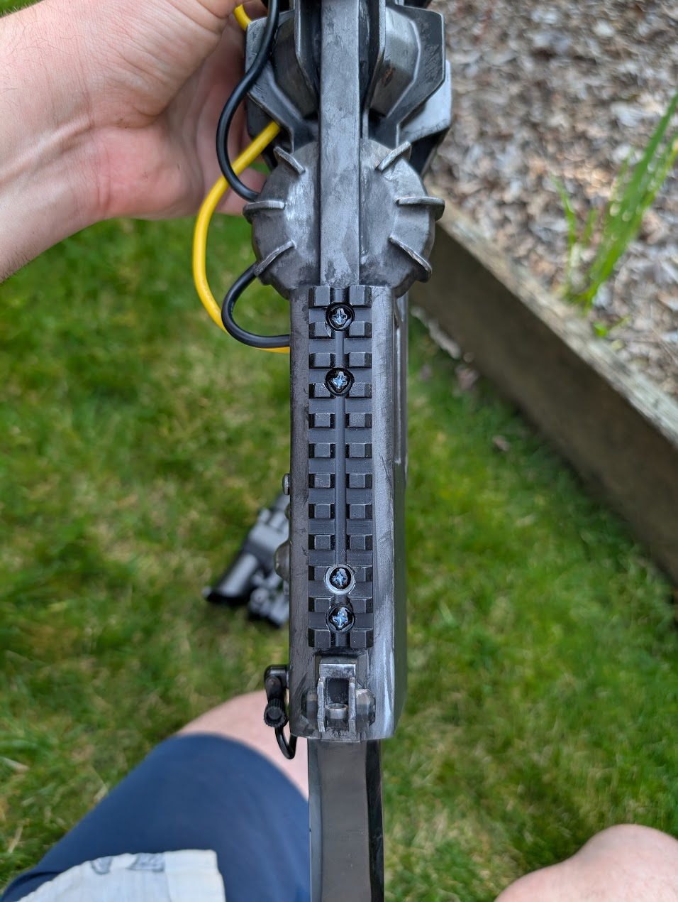

## Intro
I had a blast making this costume; it wasn't the most technical project, but it was really fulfilling on a personal level and got to bring one of my characters to life.

This is my first "content" post, so I am not sure how to structure things moving forward, but I plan on doing individual posts about the props and their creation process, and then a post for how everything came together (which is this).

### What is "STALKER"?

> The name "S.T.A.L.K.E.R." is a backronym for Scavengers, Trespassers, Adventurers, Loners, Killers, Explorers and Robbers.

Apart from a really bad hashtag to try and use, [STALKER](https://en.wikipedia.org/wiki/S.T.A.L.K.E.R.) is a first-person shooter survival horror RPG that was first released in 2007 for PC.

Basically, it's a game about being a post-apocalyptic treasure hunter in a radioative post-soviet wonderland. I ended up getting the game for my birthday circa 2007, and must have dumped a thousand hours into the STALKER trilogy through the following decade.

Fast forward to today, and I'm about to get my fix back on - STALKER 2 is almost here! After playing the demo at PAX West, I think it's safe to say that the wait will be worth it.

I also got to shoot with the GSC crew at the STALKER 2 booth! I had a really hard time not completely fanboying it up!

## Concept & Design
Coming right off another big project, I decided that my time would be better spent focusing on prop making versus fabric projects. This meant that the "Sunrise Suit" that's common with other STALKER cosplayers was off the table for me.

I opted instead to base my build off of a Gorka (Горка) K2 combat suit, which I had recently acquired for... unrelated purposes. This offered a good base to accessorize on top of.

### The Battle Rig
In an attempt to stick with the Soviet-surplus '90s vibe of the gear, I actually attempted to get a SMERSH (СМЕРЧ) rig to build the rest of my costume off of. 

.

Unfortunately, the American company I ordered through wasn't able to deliver on time, so I ended up going with an airsoft knock-off model.

This actually ended up working out because the knock-off model incorrectly has the stuff-sack on the upper back instead of the lower back - but this oversight allowed me to hook up a WWI German gas mask cannister. The original plan for this was to be an "anomaly" container with lights and a plexiglass window, but, I ran out of time. Perhaps a future improvement?

### The Rest of the Kit

#### "Echo" Detector

#### Compass Artifact

#### Gauss Gun

#### Snork Trophy

## Construction

## Finishing Touches

## Ready for the Zone
 

### The Loadout

My favorite part of this costume was putting the props together.