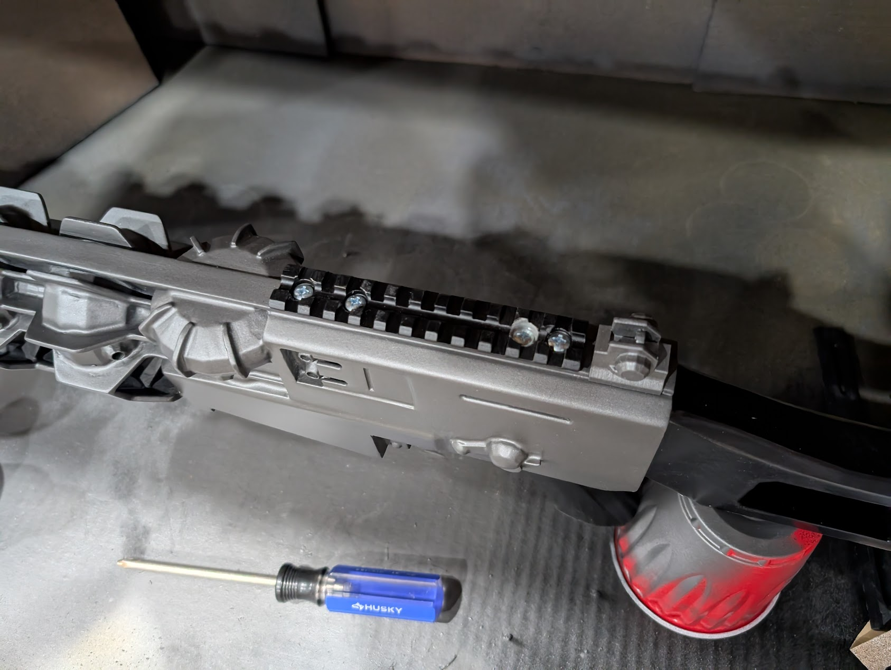
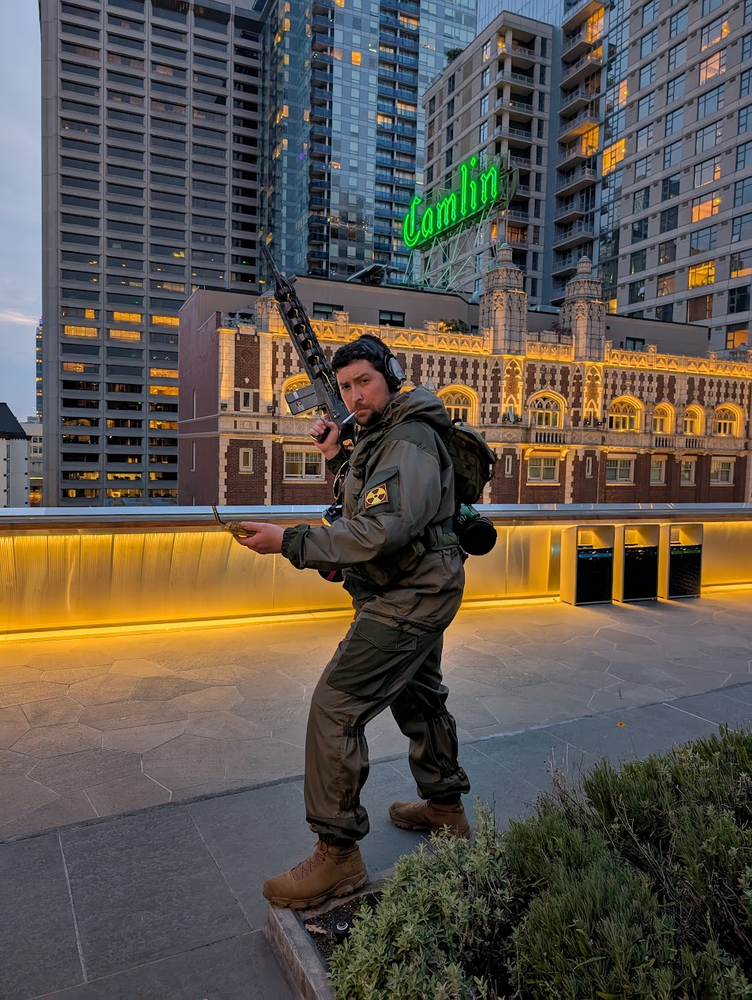
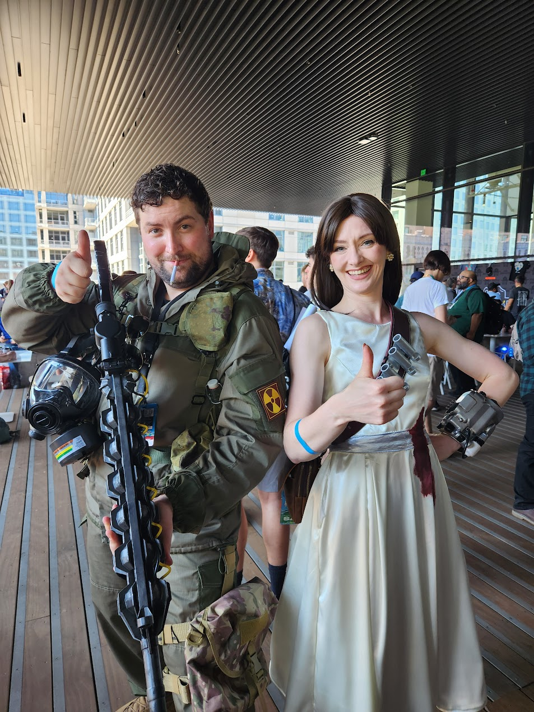

## Intro
I had a blast making this costume; it wasn't the most technical project, but it was really fulfilling on a personal level and got to bring one of my characters to life.

I plan on doing individual logs about the kit props and their creation process. I'm in the process of editing the build videos since everything came together kind of last minute, but I didn't want to hold off on making this post!

### What is "STALKER"?

> The name "S.T.A.L.K.E.R." is a backronym for Scavengers, Trespassers, Adventurers, Loners, Killers, Explorers and Robbers.

Apart from a really bad hashtag to try and use, [STALKER](https://en.wikipedia.org/wiki/S.T.A.L.K.E.R.) is a first-person shooter survival horror RPG that was first released in 2007 for PC.

Basically, it's a game about being a post-apocalyptic treasure hunter in a radioative post-soviet wonderland. I ended up getting the game for my birthday circa 2007, and must have dumped a thousand hours into the STALKER trilogy through the following decade.

Fast forward to today, and I'm about to get my fix back on - STALKER 2 is almost here! After playing the demo at PAX West, I think it's safe to say that the wait will be worth it.

I also got to shoot with the GSC crew at the STALKER 2 booth! I had a really hard time not completely fanboying it up!

## Concept & Design
Coming right off another big project, I decided that my time would be better spent focusing on prop making versus fabric projects. This meant that the "Sunrise Suit" that's common with other STALKER cosplayers was off the table for me.

I opted instead to base my build off of a Gorka (Горка) K2 combat suit, which I had recently acquired for... unrelated purposes. This offered a good base to accessorize on top of. The nice part about STALKER cosplays is that there's no specific character you have to kit up as, so, I let my gut guide me on that. I wanted to build a STALKER that would embody how I imagined my character, myself, in the Zone.

### The Battle Rig
In an attempt to stick with the Soviet-surplus '90s vibe of the gear, I actually attempted to get a SMERSH (СМЕРЧ) rig to build the rest of my costume off of. 

Unfortunately, the American company I ordered through wasn't able to deliver on time, so I ended up going with an airsoft knock-off model in kind of a weirdo dingy camo pattern called "Ruin".

 

This actually ended up working out because the knock-off model incorrectly has the stuff-sack on the upper back instead of the lower back - but this oversight allowed me to hook up a WWI German gas mask cannister. The original plan for this was to be an "anomaly" container with lights and a plexiglass window, but, I ran out of time. Perhaps a future improvement?

The other mod I ended up needing to do was ripping out the girth straps around the natural waist and lower hips. I'm, uh, less malnourished than whoever this was made for. I replaced the webbing with stuff 1" and 1.5" nylon from a US manufacturer, and replaced the plastic buckles with metal cobra buckles. A fate that will probably happen to the real SMERSH when it shows up.

I also think the camo ended up working out pretty well, and did a good job being distinct from my two-tone green suit.

### The Kit
Apart from the fabrics, there was exactly one objective I had when designing this costume - I wanted to make a Gauss Rifle. They say the real Gauss Rifle was the friends you made along the way, and I have to say for secondary objectives I am really happy with how the rest of the kit came out.

> I will eventually get around to full build logs of each of these props for those of you interested in making your own!

#### Echo Detector
 

This thing was an absolute blast to work on. In the video game this little device helps the player detect anomalies in their search of artifacts. How this prop works though is there is an Arduino inside which runs a program that produces a flash and a beep based on local Bluetooth Low Energy signals.

<video controls src="PXL_20240901_010438665.mp4" title="Detector in Action!"></video>

The end result was an interactive prop that I was able to comb the convention floor with! It was a real head turner and conversation starter!

Huge shout out to [DoctorZer0](https://www.printables.com/model/823279-stalker-echo-detector-printable-model) for creating such an awesome model, providing the groundwork for the Arduino code, and giving a screenshot of the internals so I could reverse engineer and build my own.

I ended up having to refactor a part of the code to work with the latest versions of the API used by the script; I will be releasing this fork, along with a parameter that will allow users to adjust the sensitivity, as there's a lot of interference in a convention.

#### Compass Artifact

#### Item 62 Gauss Rifle

#### Snork Trophy

## Construction

## Finishing Touches

## Ready for the Zone
 

### The Loadout

My favorite part of this costume was putting the props together.