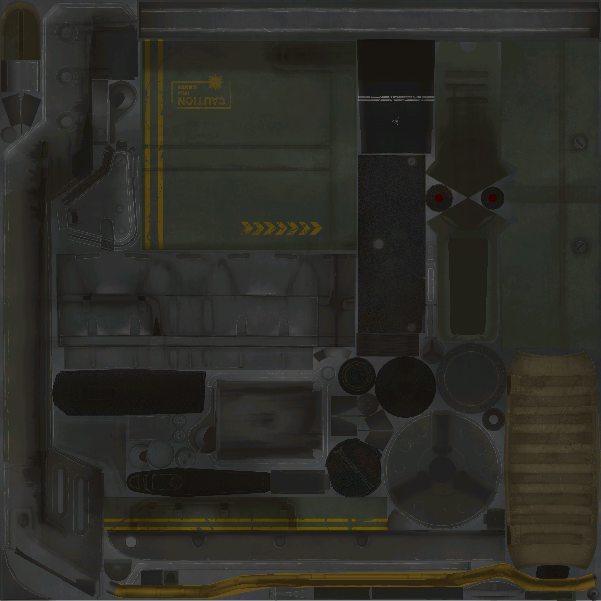

# Fallout Automatic Laser Rifle


## Decals & Stencils
One of the things I thought would really elevate this build would be to include game accurate decals on the laser. I had a pretty hard time finding resources on these, so I ended up making my own based on texture rips from the Fallout 4 HD pack.

### Tools Used
This could be its own blog post, so I'll keep the nerd shit short.

I started with the [Bethesda Archive Extractor](https://www.nexusmods.com/skyrimspecialedition/mods/974) to dump out the DDS files, which look like this:


From there I used the following toolchain running locally on one of my dev boxes:
```
game textures (.dds/.png)  ──┐
STL stencils                 ├─► measure (NumPy/SciPy/trimesh)
A4 reference PDF (Poppler)  ──┘         │
                                        ▼
                     rebuild as geometry (Shapely + fontTools)
                                        │
                        ┌───────────────┼────────────────┐
                        ▼               ▼                ▼
                 curves-only SVG   600 DPI PNG     weathered PNG
                 (mm canvases)     (cairosvg)      (noise pipeline)
```